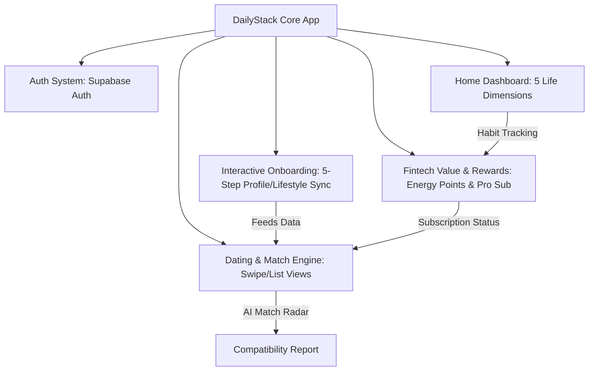
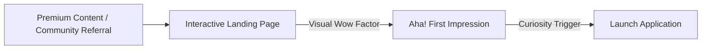
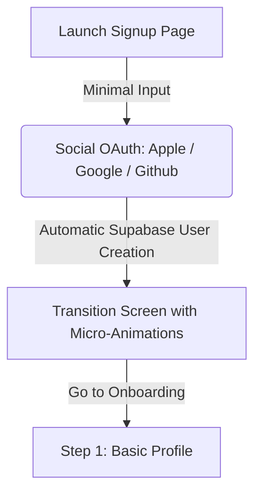
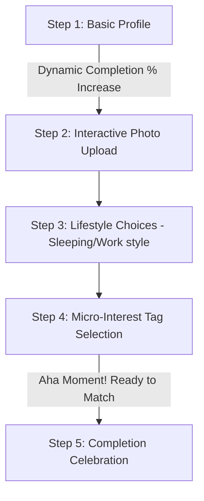
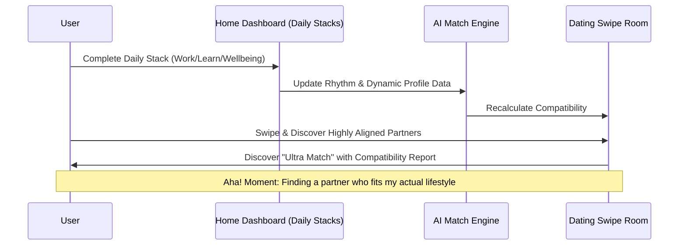
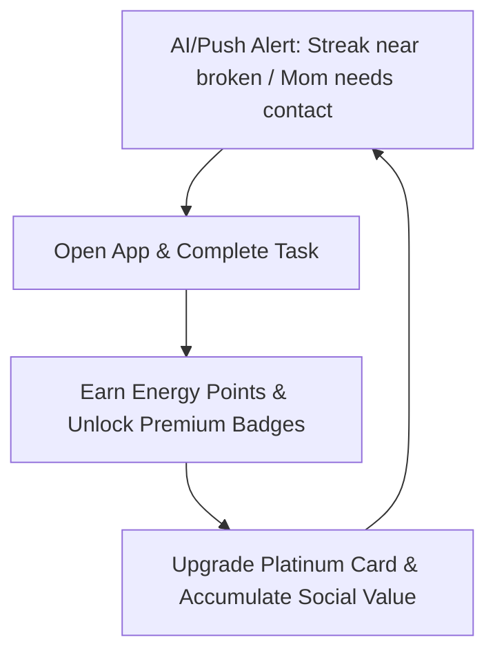
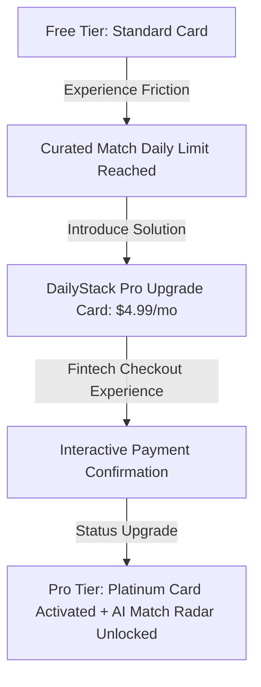
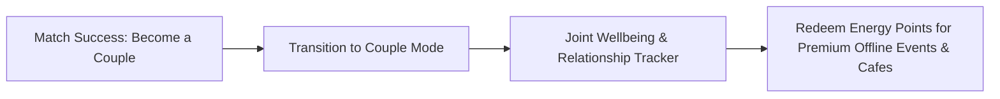

# DailyStack: AI-Powered Lifestyle Discovery & Membership Platform
## Comprehensive Product Analysis & Global Startup Customer Journey Workflow

---

## 1. Executive Summary & Codebase Analysis

**DailyStack** คือแพลตฟอร์มที่ผสมผสาน **Habit-Building, Life-Balancing, AI Matching และ Premium Fintech-style Gamification** เข้าด้วยกันอย่างมีระดับ โดยไม่ได้จำกัดตัวเองเป็นเพียงแอปหาคู่ทั่วไป (Dating App) แต่เป็น **Ecosystem** ที่ครอบคลุมทั้งการทำงาน (Work), การเรียนรู้ (Learn), สังคมและความสัมพันธ์ (Relationships), ความหลงใหล (Passions) และการดูแลรักษาสุขภาพ (Wellbeing) 

จากการวิเคราะห์สถาปัตยกรรมและโค้ดของแพลตฟอร์มอย่างละเอียด พบว่าระบบประกอบด้วยโครงสร้างหลักที่สำคัญดังนี้:

### รายละเอียดระบบแต่ละส่วน (How it Works)

1. **Authentication (Supabase Auth)**:
   * จัดการระบบล็อกอิน สมัครสมาชิก กู้คืน และรีเซ็ตรหัสผ่านแบบไร้รอยต่อ (`LoginPage`, `SignUpPage`, `ForgotPasswordPage`, `ResetPasswordPage`) ทำงานร่วมกับระบบการจัดการ Session ของ Supabase
   * มี **ProtectedRoute Component** เพื่อความปลอดภัย ป้องกันไม่ให้ผู้ใช้เข้าถึงหน้าหลักก่อนการยืนยันตัวตนสำเร็จ

2. **Onboarding System (`Onboarding.tsx`)**:
   * **กระบวนการเก็บข้อมูลอัจฉริยะ 5 ขั้นตอน** ที่เน้น Interactive UX เป็นมิตรและกระตุ้นการเล่น (Gamified Form):
     * *Step 1 (Basic)*: ข้อมูลพื้นฐาน เช่น ชื่อ, วันเกิด (คำนวณอายุอัตโนมัติ), เพศ, และประเทศ
     * *Step 2 (Photos)*: อัปโหลดรูปภาพ 3-6 รูปเข้าสู่ Supabase Storage พร้อมตัวบ่งชี้ภาพหลัก (Main Photo)
     * *Step 3 (Lifestyle)*: เลือกตารางนอน (Sleep Schedule), รูปแบบทำงาน (Work Style), พลังงานทางสังคม (Social Energy), และเป้าหมายความสัมพันธ์ (Relationship Goals)
     * *Step 4 (Interests)*: เลือกความสนใจพิเศษ เช่น กาแฟสเปเชียลตี้, ฟิตเนส, เทคโนโลยี (เลือกขั้นต่ำ 3 อย่าง)
     * *Step 5 (Done)*: คำนวณเปอร์เซ็นต์ความสมบูรณ์ของโปรไฟล์ (Profile Completion Score) เพื่อกระตุ้นให้ผู้ใช้ใส่ข้อมูลเพิ่มขึ้น

3. **5 Life Dimensions Dashboard (`HomeDashboard.tsx`)**:
   * ออกแบบมาให้เข้ากับไลฟ์สไตล์การพัฒนาตนเองอย่างมีระดับ (High-productivity & Balanced Life) แบ่งเป็น **5 Stacks**:
     * **Work & Creation** (`#C0F500` - Neon Lime): จัดการเป้าหมายระยะสั้น-ยาว 12 สัปดาห์ และ Task ในการทำงาน
     * **Learning & Growth** (`#56BE89` - Mint Green): ติดตามวันสะสมการเรียนรู้ต่อเนื่อง (Streak) และแนะนำหัวข้อการพัฒนาตัวเองผ่าน AI Study Companion
     * **Relationships** (`#FF6B9D` - Coral Pink): ติดตามการติดต่อและให้ความสำคัญกับคนที่รัก (เช่น ครอบครัว, เพื่อนฝูง, และคนรัก) เพื่อป้องกันความเหินห่าง
     * **Passions & Legacy** (`#9B5DE5` - Amethyst): การสร้างสรรค์ผลงานเสริม, งานอดิเรก และความฝันส่วนตัว
     * **Well-being** (`#FFB800` - Amber Gold): ติดตามพฤติกรรมการนอนหลับและระดับพลังงาน (Energy Levels)
   * **Core Interaction**: การทำงานสำเร็จ (Stack completed) จะช่วยปิดวงกลมความสำเร็จรายสัปดาห์ (Progress Ring) ให้เต็ม 100%

4. **Dating & AI Matching Engine (`DatingDashboard.tsx`, `Dating.tsx`)**:
   * มีหน้าตา UI ระดับพรีเมียม สนับสนุนทั้ง **Swipe Mode** (สไลด์การ์ดหาคู่) และ **List Mode** (ดูโปรไฟล์แบบกริด)
   * ระบบควบคุมสิทธิ์ผู้ใช้จำลอง (Match Limits) ที่จำกัดการปัดการ์ดต่อวันระหว่าง Curated Matches และ Explore Matches เพื่อสร้างความแตกต่างระหว่างสมาชิกฟรีและเสียเงิน
   * **Compatibility Report (`CompatibilityReport.tsx`)**: หน้าจอวิเคราะห์ความเข้ากันได้เชิงลึกด้วย AI ประมวลผลจาก 4 มิติหลัก:
     * **Lifestyle (30% weight)**: การใช้ชีวิตประจำวัน, ตารางนอน, รูปแบบทำงาน
     * **Personality (25% weight)**: ลักษณะนิสัย, MBTI และความเข้ากัน
     * **Emotional (20% weight)**: ความฉลาดทางอารมณ์ ค่านิยมและเป้าหมายระยะยาว
     * **Communication (15% weight)**: สไตล์การสื่อสารและการแก้ไขความขัดแย้ง
   * แสดงความเข้ากันได้เป็นเปอร์เซ็นต์ พร้อมระบุจุดแข็ง (Top Strengths), จุดที่ต้องระวัง (Areas to Watch), แนะนำหัวข้อสนทนา (Conversation Tips) และสัญลักษณ์พิเศษ "Ultra Match" 

5. **Fintech Value & Rewards System (`ValuePage.tsx`)**:
   * เปลี่ยนแนวคิดการสะสมความมีวินัยให้มีมูลค่าในรูปแบบ **Premium Cyber-Technical Fintech Dashboard**
   * มีแผงจำลองบัตรเครดิตพรีเมียม **DailyStack Platinum** แสดงแต้มสะสมพลังงาน (Energy Points) ที่ได้รับเมื่อทำ Daily Stacks หรือมีวินัยอย่างสม่ำเสมอ
   * หน้าอัปเกรดสมัครสมาชิก **DailyStack Pro ($4.99/mo)** เพื่อปลดล็อกฟีเจอร์พรีเมียม เช่น *AI Match Radar*

---

## 2. Customer Journey Workflow Design (Global Startup Standard)

เพื่อให้ DailyStack ประสบความสำเร็จในระดับสากลเฉกเช่นเดียวกับแบรนด์ชั้นนำอย่าง *Tinder, Spotify, Duolingo และ Linear* เราได้ออกแบบ Customer Journey Workflow ที่ประสานมิติของ **Product UX, User Behavior** และ **Business Flow** เข้าด้วยกันอย่างสมบูรณ์แบบ ดังรายละเอียดต่อไปนี้:

---

### Step 1: การเข้ามาครั้งแรก (First-time User / Acquisition)

ผู้ใช้ในกลุ่มเป้าหมาย (High-Agency/Productive Individual) ค้นพบแอปพลิเคชันจากช่องทางต่าง ๆ และสัมผัสประสบการณ์แรก (First Touchpoint)

* **Product UX (Wow Factor & Aesthetic)**:
  * Landing page ใช้สไตล์ "Void Dark Theme" ประดับด้วยละอองเรืองแสง (Glow Orbs) และการจับคู่สีแบบ Neon Lime มีความหรูหรา น่าตื่นเต้น และไม่รู้สึกว่าเป็นแค่ "แอปปัดขวาหาคู่แบบฉาบฉวย"
  * โชว์ระบบ "5 Life Dimensions" และการันตีด้วยข้อความเชิงลึก เช่น *"Find the one who matches your daily rhythm."*
  * หน้าหลักเน้นการแสดงผลการเคลื่อนไหวที่นุ่มนวลแบบ Spring Physics ไม่ให้ดูแข็งทื่อ
* **User Behavior (จิตวิทยาผู้ใช้งาน)**:
  * ผู้ใช้กลุ่ม High-Agency มักจะมองหาแอปพลิเคชันที่ช่วยยกระดับภาพลักษณ์และความคิด (Aesthetic and Intellectual Status symbol) พวกเขาเบื่อแอปปัดขวาแบบทั่วไป แต่เมื่อเห็น DailyStack ที่ผสานเรื่อง Productivity และ Lifestyle เข้าด้วยกัน จะเกิดความรู้สึก "นี่แหละคือพื้นที่ของคนกลุ่มเดียวกับเรา"
* **Business Flow (กลยุทธ์การตลาดและการรับลูกค้า)**:
  * **Targeting**: จับกลุ่มคนรุ่นใหม่ที่รักการพัฒนาตัวเอง, คนสายเทคโนโลยี, และสตาร์ทอัพ
  * **Channels**: เจาะตลาดกลุ่มเป้าหมายผ่านพอดแคสต์พัฒนาตัวเอง, ชุมชนการทำงาน, และบล็อกการจัดการชีวิต
  * **Goal**: สร้างความตระหนักรู้ ดึงดูดผู้ใช้งานคุณภาพสูงให้ดาวน์โหลดหรือเข้าสู่ขั้นตอนการสมัครสมาชิก

---

### Step 2: ขั้นตอนการสมัครใช้งาน (Frictionless Sign-Up)

สร้างกระบวนการสมัครที่เรียบง่ายที่สุดและลดแรงต้าน (Friction) ในการเข้าสู่ระบบให้มากที่สุด

* **Product UX (ความลื่นไหล)**:
  * หน้าจอ Sign-up มีเพียงกล่องกรอกอีเมล หรือระบบลงทะเบียนด้วยคลิกเดียว (OAuth: Google / Apple / Github) ที่ทำงานร่วมกับ Supabase Auth
  * การเปลี่ยนหน้า (Transitions) ระหว่าง Log In / Sign Up มีการใช้เฟดแอนิเมชันที่สวยงามพร้อมแสดงข้อความสั้น ๆ สร้างแรงบันดาลใจ
* **User Behavior (จิตวิทยาผู้ใช้งาน)**:
  * ผู้ใช้มีระดับความอดทนต่ำมากในขั้นตอนนี้ หากต้องกรอกรหัสผ่าน 2 ครั้ง หรือรออีเมลยืนยันตัวตนนานเกินไป จะเกิดการเลิกใช้งาน (Drop-off) ทันที
  * การมีตัวเลือก Social Sign-in ช่วยขจัดกำแพงนี้ออกไปได้มากกว่า 80%
* **Business Flow**:
  * ลงทะเบียนข้อมูลผู้ใช้งานพื้นฐานเข้าสู่ Supabase Database
  * ส่งข้อมูลผู้ใช้งานไปยังระบบ Analytics เพื่อวัดอัตรา Conversion Rate จากหน้า Landing Page ไปสู่ขั้นตอน Onboarding (Sign-up Funnel)

---

### Step 3: Onboarding (Habit-to-Profile Sync)

การกรอกข้อมูลโปรไฟล์ไลฟ์สไตล์ของตนเองผ่านขั้นตอนที่รู้สึกสนุกสนาน เพลิดเพลิน และไม่น่าเบื่อเหมือนการกรอกใบสมัครทั่วไป

* **Product UX (เปลี่ยนฟอร์มให้กลายเป็นเกม)**:
  * การใช้ **StepProgress Bar** สีไล่ระดับจาก Neon Lime ไปยัง Mint Green บอกระดับเปอร์เซ็นต์ความคืบหน้าอย่างชัดเจนทุกครั้งที่กรอกข้อมูล
  * **Lifestyle Selection**: ตัวเลือกนอนหลับ การทำงาน และสไตล์ทางสังคม แสดงผลด้วยการ์ดที่มี Emoji และคำอธิบายย่อที่เข้าใจง่าย (เช่น Early Bird 🌅, Night Owl 🦉) เมื่อกดเลือกจะมีการขยายตัวเล็กน้อยและสั่นไหวเล็กน้อย (Haptic-style Feedback)
  * **Photo Upload**: แสดงหน้าโปรไฟล์จำลองทันทีเมื่ออัปโหลดรูป ทำให้เห็นภาพว่าหน้าตาโปรไฟล์ของตนเองจะพรีเมียมขนาดไหนเมื่อคนอื่นมาเห็น
* **User Behavior (จิตวิทยาผู้ใช้งาน)**:
  * ผู้ใช้ยินดีให้ข้อมูลไลฟ์สไตล์อย่างละเอียด เพราะรู้สึกว่านี่คือการทำ "แบบทดสอบวิเคราะห์ตนเอง" (Self-Discovery Quiz) ที่กำลังช่วยสร้างภาพลักษณ์ของเขาในระบบ และมั่นใจว่าตัวกรองนี้จะคัดคนที่มีคุณภาพและมีความชอบคล้ายกันมาให้จริง ๆ
* **Business Flow**:
  * ดึงข้อมูลไลฟ์สไตล์ ค่านิยม และ MBTI บันทึกลงในระบบเพื่อประมวลผลการคำนวณ Compatibility ด้วย AI
  * **Metric to Watch**: *Onboarding Completion Rate* (วัดว่าผู้ใช้ทำถึงขั้นตอนสุดท้ายกี่เปอร์เซ็นต์ โดยมาตรฐานสากลควรมากกว่า 70%)

---

### Step 4: การใช้งานฟีเจอร์หลัก (Core Value Loop: Stacks & AI Matching)

คือส่วนสำคัญที่สุดในการส่งมอบ "คุณค่าหลัก" (Value Proposition) ของแบรนด์ให้ผู้ใช้เห็นเด่นชัดที่สุด (Aha! Moment)

* **Product UX (Aha! Moment)**:
  * **Daily Stacks (Home Dashboard)**: เมื่อผู้ใช้งานเช็คเป้าหมายรายวัน เช่น "บันทึกเวลาเรียน 30 นาที" หน้าจอจะสร้างการเคลื่อนไหวที่สะท้อนถึงการบรรลุเป้าหมาย และวงกลม Progress Ring สัปดาห์จะหมุนไปข้างหน้าพร้อมกับการสะสม Energy Points 
  * **AI Match Radar (Dating)**: แสดงผลการเปรียบเทียบตารางชีวิตในหน้าโปรไฟล์ของคู่อื่น เช่น *"She is also an Early Bird hybrid developer!"*
  * **Compatibility Report**: เมื่อเกิดการแมตช์หรือสนใจใครสักคน ผู้ใช้สามารถเปิดรายงานวิเคราะห์ความเข้ากันได้ ซึ่งจำลองการนำข้อมูลการนอน รูปแบบงาน ค่านิยมมาประมวลผลออกมาเป็น Chart ที่วิเคราะห์เชิงจิตวิทยาและชี้จุดเด่น เช่น "มีความเข้ากันด้านการสื่อสารสูงมากถึง 91%"
* **User Behavior (จิตวิทยาผู้ใช้งาน)**:
  * ผู้ใช้รู้สึกว่านี่ไม่ใช่แอปหาคู่ที่ประเมินแค่เพียงหน้าตา (ซึ่งสร้างความเหนื่อยล้าทางอารมณ์สูง) แต่มันคือแอปจับคู่คนที่มี "จังหวะชีวิตเดียวกัน" (Circadian & Lifestyle Alignment) ทำให้การคุยกันต่อมีคุณภาพและมีหัวข้อสนทนาเริ่มต้นที่ลึกซึ้งทันที
* **Business Flow**:
  * ข้อมูลการทำ Stacks ของผู้ใช้กลายมาเป็น Dynamic Matching Filters ทำให้ประสิทธิภาพการแมตช์ของระบบแม่นยำกว่าการจับคู่แบบสุ่มทั่วไป
  * **Metric to Watch**: *Core Action Frequency* (เช่น ปริมาณความถี่การปัดการ์ด และจำนวน Stack ที่สำเร็จต่อสัปดาห์)

---

### Step 5: การสร้าง Engagement (Retention Hooks & Gamification)

กระตุ้นให้ผู้ใช้งานเปิดโปรแกรมมาทำกิจกรรมเป็นประจำโดยใช้หลักจิตวิทยา Habit Loop และ Gamification

* **Product UX (Gamified Habit)**:
  * **Streak Mechanics**: หน้าสะสมคะแนนที่มีการเก็บ Streak การเรียนรู้ หรือความมีวินัย (เช่น 47 Days Streak 🔥) ทำให้รู้สึกว่ามีสิทธิ์ประโยชน์ที่ตนเองไม่อยากทำลาย (Loss Aversion)
  * **Relationship Care Alert**: ระบบส่งสัญญาณแจ้งเตือนเชิงบวก เช่น *"คุณแม่ไม่มีการติดต่อมา 2 สัปดาห์แล้ว ลองส่งข้อความหาท่านวันนี้เพื่อความสัมพันธ์ที่ดีขึ้น"* ช่วยเชื่อมโยงชีวิตจริงกับแอปพลิเคชัน
  * **Energy Ledger**: หน้าแสดงประวัติการรับ Energy Points คล้ายระบบ Mobile Banking ให้ความรู้สึกเหมือนกำลังได้สิทธิประโยชน์ทางการเงินจากความมีวินัยของตนเอง
* **User Behavior (จิตวิทยาผู้ใช้งาน)**:
  * ผู้ใช้เกิดพฤติกรรมเคยชิน (Habitual Behavior) ในการเข้ามาเช็คและจัดระเบียบชีวิตผ่านแอป ไม่เพียงเพื่อการหาคู่เดทเท่านั้น แต่เพื่อความพึงพอใจในการเห็นแถบความสำเร็จและการรักษาสมดุลชีวิตตนเอง
* **Business Flow**:
  * เพิ่มจำนวน Daily Active Users (DAU) และรักษาอัตราการใช้งานแอปพลิเคชันให้อยู่ระดับสูง
  * **Metric to Watch**: *DAU/MAU Ratio (Stickiness)* ที่สูงกว่า 40%

---

### Step 6: การเปลี่ยนผู้ใช้ฟรีให้กลายเป็นสมาชิกแบบชำระเงิน (Conversion Loop)

แปลงฐานผู้ใช้งานฟรีคุณภาพสูงให้เปลี่ยนมาสนับสนุนทางการเงินแก่แพลตฟอร์มด้วยความยินดี ผ่านการสร้างมูลค่า (Value) และแรงเสียดทานที่เป็นมิตร (Friendly Friction)

* **Product UX (Sleek Fintech Paywall)**:
  * เมื่อผู้ใช้ฟรีใช้โควตาปัดการ์ด (Match Limits) ครบกำหนด แพลตฟอร์มจะนำเสนอหน้าจอ **Value & Rewards** ที่งดงาม ด้วยบัตรจำลอง *DailyStack Platinum* สีดำด้านสไตล์ Cyberpunk ที่พร้อมอัปเกรดเป็น PRO MEMBER
  * **Paywall Content**: ระบุคุณค่าที่จะได้รับ เช่น *"ปลดล็อก AI Match Radar สแกนคู่อย่างไม่จำกัด พร้อมรับรายงานวิเคราะห์ความเข้ากันได้เชิงจิตวิทยาในทุกมิติ"* ในราคาเพียง $4.99/เดือน
  * มีระบบแอนิเมชันจำลองการอนุมัติบัตรเครดิตและการระเบิดอนุภาคแสงนีออนเมื่อการชำระเงินเสร็จสิ้น สร้างความอิ่มเอมใจให้ลูกค้า (Aesthetic Gratification)
* **User Behavior (จิตวิทยาผู้ใช้งาน)**:
  * ด้วยราคา $4.99 ซึ่งใกล้เคียงกับราคาของกาแฟหนึ่งแก้ว ผู้ใช้กลุ่มวัยทำงานพร้อมที่จะจ่ายได้อย่างง่ายดาย (Micro-transaction threshold) หากฟีเจอร์พรีเมียมนั้นช่วยประหยัดเวลาและช่วยคัดกรองความสัมพันธ์ที่มีคุณภาพให้แก่พวกเขาได้จริง
* **Business Flow**:
  * ขับเคลื่อนรายได้หลักแบบรายเดือน (Monthly Recurring Revenue - MRR)
  * **Metric to Watch**: *Paywall Conversion Rate* และ *Customer Acquisition Cost (CAC) to LTV Ratio* (ควรอยู่ที่ 1:3 เป็นอย่างน้อย)

---

### Step 7: การรักษาผู้ใช้งานให้อยู่กับระบบระยะยาว (LTV & Long-Term Loyalty)

แก้ไขจุดอ่อนที่ใหญ่ที่สุดของอุตสาหกรรมแอปหาคู่ (เมื่อผู้ใช้งานแมตช์เจอกันสำเร็จ จะพากันลบแอปทิ้ง) โดยการเปลี่ยนผ่านเข้าสู่ **Couple Life Ecosystem & Real Economy**

* **Product UX (Couple Mode & Offline Ecosystem)**:
  * **Couple Mode**: เมื่อผู้ใช้ตกลงปลงใจเป็นแฟนหรือคนรักกัน แอปพลิเคชันมีปุ่มให้เปลี่ยนเข้าสู่ "โหมดคู่รัก" ซึ่งหน้าจอจะเปลี่ยนจากการหาเดท เป็น **Shared Home Dashboard** เพื่อช่วยกันจัดตารางชีวิต รักษาสมดุลความสัมพันธ์ และปิดวงกลมความสำเร็จร่วมกัน (Collaborative Stacks)
  * **Real Economy Integration**: คะแนน Energy Points ที่สั่งสมมาจากการรักษาวินัย สามารถนำไปใช้แลกรับส่วนลดและบัตรสิทธิพิเศษในร้านค้าพันธมิตรที่เป็นไลฟ์สไตล์ระดับพรีเมียม เช่น ร้านกาแฟสเปเชียลตี้ โรงแรมบูทิก หรืออีเวนต์เวิร์กช็อปพิเศษที่แอปเป็นผู้จัด
* **User Behavior (จิตวิทยาผู้ใช้งาน)**:
  * ความเป็นเจ้าของร่วมกัน (Co-ownership and Investment): ผู้ใช้มีคะแนนสะสมและประวัติการเดินทางของชีวิตและคู่อยู่ในระบบจำนวนมาก (Sunk Cost) และแอปยังมีประโยชน์ในการดูแลความรักระยะยาว ทำให้พวกเขารู้สึกผูกพันและเลือกที่จะรักษาสมาชิกภาพต่อไปแทนการลบทิ้ง
* **Business Flow**:
  * เปลี่ยนจาก Transaction Business (แอปเดททั่วไป) มาเป็น **Platform / Marketplace Economy** ดึงดูดสปอนเซอร์และร้านค้าพันธมิตรระดับสูงเข้ามาสร้างรายได้ร่วมกัน (B2B2C Revenue Stream)
  * **Metric to Watch**: *Churm Rate* ของลูกค้าแบบคู่รัก และ *LTV (Lifetime Value)* ที่ยาวนานขึ้นจากปีเป็นหลายปี

---

## 3. Comprehensive Summary of Customer Journey Steps

| Step | Product UX & Interaction | User Behavior & Psychology | Business Flow & Metrics |
|:---|:---|:---|:---|
| **1. First Touchpoint** | Premium dark-themed landing page, smooth spring animations, lifestyle and compatibility indicators. | Curiosity to explore a high-agency lifestyle space; looking for high-quality connections. | **Ad Conversion Rate**: Brand positioning and attraction of high-agency target audiences. |
| **2. Registration** | Frictionless 1-click Social Sign-In (Supabase Auth). Elegant transitional flow. | Minimal effort required, low drop-off risk, immediate entry. | **Registration Conversion Rate**: Tracking signup drop-offs in real-time. |
| **3. Onboarding** | Gamified progress bar, highly interactive emoji cards, drag-and-drop photo upload to Supabase. | Self-discovery mindset; excited to see dynamic completion percentages. | **Onboarding Completion %**: Ensuring users fill in high-quality data to feed the AI. |
| **4. Core Value Loop** | 5 Stacks Dashboard (Work, Learn, Relationships, Passion, Wellbeing) + AI Compatibility Reports. | "Circadian & Rhythm Match" concept makes users feel their daily life details actually matter. | **Core Action Frequency**: Tracking daily swipe activities, matches, and daily stack tasks completed. |
| **5. Engagement** | Daily/Weekly Streaks, Energy Points (PTS), AI reminders to contact loved ones (Relationships care). | Habit loop is formed. Loss aversion regarding breaking streaks; gamified fintech rewards. | **DAU/MAU Ratio (Stickiness)**: Retention monitoring; ensuring high weekly activity. |
| **6. Monetization** | Cyberpunk fintech virtual credit card paywall, premium micro-animations upon Pro activation ($4.99/mo). | Low barrier to pay; payment feels like an investment in self-improvement and relationship success. | **MRR (Monthly Recurring Revenue)**: Sustained revenue growth and low customer acquisition cost. |
| **7. Retention & LTV** | Couple Mode (shared dashboard for couples) + Energy Points marketplace redemption for premium cafes/events. | Sunk cost of shared history; continued utility in organizing couple life and enjoying premium discounts. | **LTV Expansion**: Lowering dating app paradox churn; opening up B2B2C merchant advertising models. |

---
*Document designed for DailyStack Global Growth & Premium UX Scaling.*
