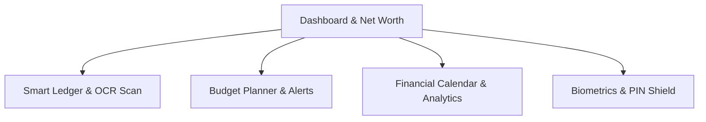
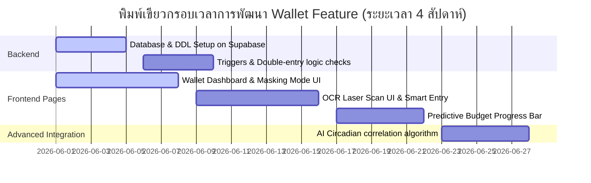

# DailyStack Wallet: Complete Product Deep Dive & Architectural Specification
## Premium Expense, Asset, and Budget Management System (v1.0)

---

> [!NOTE]  
> เอกสารสบับนี้จัดทำขึ้นเพื่อเจาะลึกรายละเอียดเชิงคุณลักษณะ (Product Specification), การออกแบบประสบการณ์ผู้ใช้ (UX/UI Detail), โครงสร้างสถาปัตยกรรมทางเทคนิค (Technical Architecture) และการออกแบบฐานข้อมูล (Database Schema) ของระบบ **DailyStack Wallet** เพื่อความพร้อมในการพัฒนาระดับ Global Startup

---

## 1. Feature Overview & Objectives (ภาพรวมและวัตถุประสงค์)

ระบบบริหารสินทรัพย์และการเงินส่วนบุคคล (Wallet & Personal Finance Companion) ของ DailyStack ได้รับแรงบันดาลใจจากความพรีเมียมของ **Rocket Money** ผสมผสานกับปรัชญาของ DailyStack ที่ต้องการผลักดันให้ผู้ใช้มีวินัยและสมดุลชีวิตในทุกมิติ โดยฟีเจอร์นี้ตั้งอยู่บนเป้าหมายเชิงกลยุทธ์ 3 ประการ:

*   **Financial Discipline as a Life Stack**: มองว่าความรอบคอบและวินัยทางการเงินเป็นหนึ่งในตัวชี้วัดความสุขของชีวิต (Wellbeing) เช่นเดียวกับการนอนหลับหรือการเรียนรู้
*   **Double-entry Bookkeeping Accuracy**: ใช้ระบบบัญชีคู่จริงเบื้องหลังในการบริหารทรัพย์สิน เพื่อความแม่นยำในการวัดมูลค่าสินทรัพย์สุทธิ (Net Worth Calculation) ไม่ให้เกิดปัญหาผลลัพธ์ขาดดุลหรือไม่ตรงกับเงินจริง
*   **Lifestyle-Financial Correlation (AI-Driven)**: นำ AI มาเชื่อมโยงระหว่างพฤติกรรมการจัดการชีวิตจริง (เวลานอนหลับ ความเครียด) เข้ากับพฤติกรรมการจ่ายเงิน เพื่อสะท้อนพฤติกรรมเชิงลึกของผู้ใช้ (Behavioral Finance Insight)

---

## 2. Product UX & Interface Design (รายละเอียดหน้าจอและดีไซน์พรีเมียม)

ฟีเจอร์ Wallet ใช้สีประจำตัวคือ **สีแดงปะการังเข้ม (Dark Coral `#D6453E`)** เป็นสีตัด (Accent) และสีกระจกฝ้า (Glassmorphism) ในธีมสีเข้ม Void Dark Theme เพื่อสร้างบรรยากาศที่น่าเชื่อถือ ล้ำสมัย และให้ความรู้สึกพรีเมียมสูงสุด



### หน้าจอที่ 1: แดชบอร์ดกระเป๋าเงินและสินทรัพย์สุทธิ (Wallet Dashboard & Net Worth)
*   **UX Layout & Aesthetics**: 
    *   ด้านบนสุดแสดงการจำลองบัตรเครดิตโปร่งแสงพรีเมียม **DailyStack Platinum** สีดำเงาตัดด้วยแสงนีออนโฮโลกราฟิก แสดงยอดทรัพย์สินสุทธิ (Net Worth) ขนาดใหญ่ด้วยฟอนต์ *Space Grotesk*
    *   มี **ปุ่ม Masking Mode (รูปดวงตาแบบ Cyberpunk)** ถัดจากยอดเงิน เมื่อกดแล้วยอดตัวเลขทางการเงินทั้งหมดจะเบลอด้วย Glassmorphism blur ทันที เพื่อความเป็นส่วนตัวเวลาเปิดใช้นอกบ้าน
    *   แผงสไลด์แสดงสินทรัพย์แยกหมวดหมู่ (Cash, Bank, Credit Cards, Investments, Debts) ที่แสดงผลยอดคงเหลือแบบเรียลไทม์
*   **Interaction**: การกดสลับการแสดงผลของทรัพย์สินสุทธิมีการตอบสนองด้วยสปริงแอนิเมชันที่ลื่นไหลและการสั่นเบา ๆ (Haptic Feedback)

### หน้าจอที่ 2: หน้าบันทึกบัญชีอัจฉริยะด้วยเลเซอร์ OCR (Smart Ledger & OCR Scan)
*   **UX Layout & Aesthetics**: 
    *   หน้าจอเรียบง่ายสไตล์มินิมอล มีกล่อง Input จำนวนเงินเด่นชัดแสดงผลด้วยฟอนต์ *JetBrains Mono*
    *   มี **ปุ่มกล้องถ่ายภาพใบเสร็จ/สลิป (Laser OCR Scanner)** สีแดงปะการังด้านล่าง
*   **Interaction & Micro-animations**: 
    *   เมื่อกดถ่ายรูปหรือเลือกรูปสลิป หน้าจอจะแสดงแอนิเมชัน **เส้นแสงเลเซอร์สีแดงปะการังพาดผ่านภาพสลิป** วิ่งขึ้นลง 2 วินาทีระหว่างที่ AI ดึงข้อมูล ยอดเงิน, ชื่อร้านค้า, วันที่, และประเภทบัญชีให้เสร็จสรรพ
    *   หลังจากประมวลผลเสร็จ แถบข้อมูลจะแสดงผลขึ้นมาให้ผู้ใช้งานตรวจสอบความถูกต้องและกดบันทึกด้วยแอนิเมชัน Scale Up ขนาดเล็ก

### หน้าจอที่ 3: ระบบวางแผนงบประมาณอัจฉริยะ (Budget Planner & Predictive Alerts)
*   **UX Layout & Aesthetics**:
    *   แสดงงบประมาณรวมประจำเดือนแยกตามหมวดหมู่ (เช่น กาแฟสเปเชียลตี้, ร้านอาหารพรีเมียม, ช้อปปิ้ง) 
    *   แถบแสดงผลระดับความคืบหน้า (Progress Bars) ไล่สีจาก เขียว $\rightarrow$ เหลือง $\rightarrow$ แดงปะการังตามสัดส่วนการใช้เงินที่เกิดขึ้นจริง
*   **Interaction**: 
    *   มีแอนิเมชันสัญญาณเตือนกระพริบเบา ๆ (Pulse Effect) สีเหลืองอำพันเมื่อยอดการใช้จ่ายพุ่งเกิน 80%
    *   AI จะปรากฏตัวขึ้นมาพร้อมข้อความวิเคราะห์แนวโน้มล่วงหน้า (Predictive Message) เช่น *"ด้วยพฤติกรรมสัปดาห์นี้ คาดว่างบช้อปปิ้งจะโอเวอร์โหลดภายใน 8 วันถัดไป (เร็วกว่าสิ้นเดือน)"*

### หน้าจอที่ 4: ปฏิทินการเงินและรายงานวิเคราะห์ (Financial Calendar & Analytics)
*   **UX Layout & Aesthetics**:
    *   ปฏิทินรายเดือนที่บอกยอดสุทธิรายวันแสดงผลอยู่ใต้เซลล์ปฏิทินทันที (ยอดบวกสีนีออนเขียว, ยอดลบสีแดงปะการัง) ทำให้มองเห็นกระแสการเงินแบบรายวัน (Daily Cash Flow Map)
    *   **Visual Reports**: Pie Chart แสดงสัดส่วนรายจ่ายแยกประเภทที่สามารถหมุนเลือกดูแบบมีมิติ และ Line Chart แสดงแนวโน้มของมูลค่าสินทรัพย์สุทธิ (Net Worth Curve) ตลอดระยะเวลา 6 เดือน
*   **Interaction**: การกดบนวันที่ในปฏิทินการเงิน จะสไลด์ลิสต์รายการธุรกรรมของวันนั้น ๆ ขึ้นมาจากด้านล่างแบบดึงขึ้น (Swipeable Bottom Sheet)

### หน้าจอที่ 5: หน้าล็อกความปลอดภัยและระบบออฟไลน์ (PIN Shield & Offline State)
*   **UX Layout & Aesthetics**:
    *   หน้าจอใส่รหัสผ่าน PIN Code 6 ตัวขนาดยักษ์ สไตล์เทคโนพรีเมียม เพื่อความมั่นใจในทรัพย์สิน
    *   แสดงผล **ไอคอน Cloud Status ขนาดเล็ก** ที่มุมจอ:
        *   *ไอคอน Cloud มีขีดฆ่าสีส้ม*: แสดงสถานะออฟไลน์ พร้อมข้อความ *"จดบันทึกปลอดภัยในเครื่องแล้ว"*
        *   *ไอคอน Cloud ลูกศรหมุนวนสีนีออนเขียว*: แสดงสถานะกำลัง Sync เชื่อมฐานข้อมูล Supabase เมื่ออินเทอร์เน็ตพร้อมใช้งาน

---

## 3. Technical Architecture & Database Design (สถาปัตยกรรมทางเทคนิค)

เพื่อให้ระบบจดบันทึกรายรับ-รายจ่ายทำงานได้อย่างถูกต้อง แม่นยำ ไม่ผิดเพี้ยนตามหลักบัญชีคู่ (Double-entry) โครงสร้างสถาปัตยกรรมและการไหลของข้อมูลจะผ่าน Supabase Client และ PostgreSQL Engine ดังนี้:

```plaintext
               +-----------------------------------+
               |  Dailystack Frontend (React PWA)  |
               +-----------------------------------+
                  |                             ^
       API Calls  |                             |  Real-time Sync
  (Offline-First) |                             |  (Cloud Sync)
                  v                             |
               +-----------------------------------+
               |      Supabase Client (Auth)       |
               +-----------------------------------+
                  |                             ^
                  | SQL Query                   | Database Triggers
                  v                             |
               +-----------------------------------+
               |      PostgreSQL (Supabase)        |
               +-----------------------------------+
               | - financial_accounts Table        |
               | - transactions Table (Double-entry|
               | - budgets Table                   |
               +-----------------------------------+
```

### 3.1. Supabase Database Schema (DDL)

```sql
-- ─── 1. ตารางกระเป๋าเงินและบัญชีทรัพย์สิน (FINANCIAL ACCOUNTS) ───
CREATE TABLE public.financial_accounts (
    id UUID PRIMARY KEY DEFAULT gen_random_uuid(),
    user_id UUID NOT NULL REFERENCES auth.users(id) ON DELETE CASCADE,
    name VARCHAR(100) NOT NULL,
    type VARCHAR(50) NOT NULL, -- 'cash', 'bank', 'credit_card', 'investment', 'debt'
    currency VARCHAR(3) NOT NULL DEFAULT 'THB',
    balance DECIMAL(12, 2) NOT NULL DEFAULT 0.00,
    credit_limit DECIMAL(12, 2) DEFAULT NULL, -- สำหรับบัญชีประเภท 'credit_card'
    interest_rate DECIMAL(5, 2) DEFAULT NULL, -- สำหรับบัญชีประเภท 'investment' หรือ 'debt'
    created_at TIMESTAMP WITH TIME ZONE DEFAULT NOW(),
    updated_at TIMESTAMP WITH TIME ZONE DEFAULT NOW(),
    
    CONSTRAINT check_account_type CHECK (type IN ('cash', 'bank', 'credit_card', 'investment', 'debt')),
    CONSTRAINT check_balance_decimals CHECK (balance = ROUND(balance, 2))
);

-- สร้าง Trigger อัปเดต updated_at
CREATE OR REPLACE FUNCTION update_modified_column()
RETURNS TRIGGER AS $$
BEGIN
    NEW.updated_at = NOW();
    RETURN NEW;
END;
$$ LANGUAGE plpgsql;

CREATE TRIGGER update_financial_accounts_modtime
    BEFORE UPDATE ON public.financial_accounts
    FOR EACH ROW EXECUTE FUNCTION update_modified_column();


-- ─── 2. ตารางธุรกรรมรายวันบัญชีคู่ (TRANSACTIONS) ───
CREATE TABLE public.transactions (
    id UUID PRIMARY KEY DEFAULT gen_random_uuid(),
    user_id UUID NOT NULL REFERENCES auth.users(id) ON DELETE CASCADE,
    amount DECIMAL(12, 2) NOT NULL,
    type VARCHAR(20) NOT NULL, -- 'income', 'expense', 'transfer'
    from_account_id UUID REFERENCES public.financial_accounts(id) ON DELETE SET NULL, -- บัญชีฝั่งเดบิต (แหล่งเงินออก)
    to_account_id UUID REFERENCES public.financial_accounts(id) ON DELETE SET NULL,   -- บัญชีฝั่งเครดิต (แหล่งเงินเข้า)
    category VARCHAR(100) NOT NULL,
    subcategory VARCHAR(100) DEFAULT NULL,
    note TEXT DEFAULT NULL,
    image_url TEXT DEFAULT NULL, -- แนบรูปภาพสลิป/หลักฐาน
    tags TEXT[] DEFAULT '{}',
    is_recurring BOOLEAN DEFAULT FALSE,
    recurrence_rule TEXT DEFAULT NULL, -- เช่น 'every_month_on_1', 'every_week_on_monday'
    transaction_date TIMESTAMP WITH TIME ZONE NOT NULL DEFAULT NOW(),
    created_at TIMESTAMP WITH TIME ZONE DEFAULT NOW(),
    
    CONSTRAINT check_transaction_type CHECK (type IN ('income', 'expense', 'transfer')),
    CONSTRAINT check_amount_positive CHECK (amount > 0),
    CONSTRAINT check_accounts_not_equal CHECK (from_account_id != to_account_id)
);


-- ─── 3. ตารางงบประมาณรายหมวดหมู่ (BUDGETS) ───
CREATE TABLE public.budgets (
    id UUID PRIMARY KEY DEFAULT gen_random_uuid(),
    user_id UUID NOT NULL REFERENCES auth.users(id) ON DELETE CASCADE,
    category VARCHAR(100) NOT NULL,
    amount_limit DECIMAL(12, 2) NOT NULL,
    period VARCHAR(20) NOT NULL DEFAULT 'monthly', -- 'weekly', 'monthly'
    start_date DATE NOT NULL,
    created_at TIMESTAMP WITH TIME ZONE DEFAULT NOW(),
    
    CONSTRAINT check_budget_limit_positive CHECK (amount_limit > 0),
    CONSTRAINT check_budget_period CHECK (period IN ('weekly', 'monthly'))
);

-- ─── 4. สร้าง INDEX เพื่อเพิ่มประสิทธิภาพการค้นหา (PERFORMANCE INDEXES) ───
CREATE INDEX idx_transactions_user_date ON public.transactions(user_id, transaction_date DESC);
CREATE INDEX idx_transactions_category ON public.transactions(category);
CREATE INDEX idx_accounts_user ON public.financial_accounts(user_id);
```

### 3.2. บัญชีคู่และการอัปเดตยอดเงินแบบอัตโนมัติ (Automated Double-Entry Balance Triggers)

เพื่อให้การคำนวณสินทรัพย์สุทธิเที่ยงตรง ตรรกะของฟังก์ชันบัญชีคู่ต้องมีการหักลบยอดเงินของกระเป๋าเงินปลายทางผ่าน **Database Trigger** อัตโนมัติในฝั่ง PostgreSQL ทุกครั้งที่มีการเขียนรายการใหม่:

```sql
CREATE OR REPLACE FUNCTION process_double_entry_balance()
RETURNS TRIGGER AS $$
BEGIN
    -- กรณีเป็นธุรกรรมประเภท รายจ่าย (EXPENSE)
    IF NEW.type = 'expense' THEN
        -- หักยอดคงเหลือออกจากกระเป๋าต้นทาง (from_account_id)
        UPDATE public.financial_accounts
        SET balance = balance - NEW.amount
        WHERE id = NEW.from_account_id;
        
    -- กรณีเป็นธุรกรรมประเภท รายรับ (INCOME)
    ELSIF NEW.type = 'income' THEN
        -- เพิ่มยอดคงเหลือในกระเป๋าปลายทาง (to_account_id)
        UPDATE public.financial_accounts
        SET balance = balance + NEW.amount
        WHERE id = NEW.to_account_id;
        
    -- กรณีเป็นธุรกรรมประเภท การโอนระหว่างบัญชี (TRANSFER)
    ELSIF NEW.type = 'transfer' THEN
        -- หักเงินต้นทาง
        UPDATE public.financial_accounts
        SET balance = balance - NEW.amount
        WHERE id = NEW.from_account_id;
        -- เพิ่มเงินปลายทาง
        UPDATE public.financial_accounts
        SET balance = balance + NEW.amount
        WHERE id = NEW.to_account_id;
    END IF;
    
    RETURN NEW;
END;
$$ LANGUAGE plpgsql;

-- เชื่อม Trigger เข้ากับตาราง Transactions
CREATE TRIGGER trigger_update_balances_after_transaction
    AFTER INSERT ON public.transactions
    FOR EACH ROW EXECUTE FUNCTION process_double_entry_balance();
```

---

## 4. Innovative Stacks Integration (แนวคิดการวิเคราะห์ข้ามมิติอัจฉริยะ)

จุดเด่นที่ทำให้ฟีเจอร์ Wallet ของ DailyStack แตกต่างจากคู่แข่งอย่างมีสไตล์และตรงตามแนวทางสตาร์ทอัพของระบบนิเวศคือการวิเคราะห์แบบข้ามข้อมูล (Cross-Domain Analysis):

### 4.1. Circadian-Financial Correlation Algorithm (คณิตศาสตร์การใช้จ่ายข้ามสุขภาพ)
ระบบ AI ของ DailyStack จะทำการรันแบบจำลองการจำแนกเชิงความสัมพันธ์ทุกสัปดาห์ เพื่อหาความอ่อนไหวในการจับจ่าย (Spending Sensitivity) สอดรับกับความบกพร่องของคุณภาพการใช้ชีวิตด้านอื่น:

$$S_{spending} = f(\text{Sleep Quality Score}, \text{Work stress level})$$

```typescript
// ฟังก์ชันจำลองประมวลวิเคราะห์เชิงลึก (AI Cross-Domain insight engine)
export const calculateSpendingVulnerability = (
  sleepScores: number[], 
  coffeeExpenses: number[]
): { correlation: number; recommendationTh: string } => {
  // คำนวณสัมประสิทธิ์ความสัมพันธ์ (Pearson Correlation) ระหว่างชั่วโมงนอนและเงินที่จ่ายค่ากาแฟ/ขนมช่วงบ่าย
  const correlation = computePearsonCorrelation(sleepScores, coffeeExpenses);
  
  if (correlation < -0.65) {
    return {
      correlation,
      recommendationTh: "AI ตรวจพบความสัมพันธ์เชิงผกผันที่ชัดเจน: ในวันที่ชั่วโมงนอนของคุณต่ำกว่า 6 ชั่วโมง ยอดใช้จ่ายในหมวดหมู่กาแฟและพลังงานเสริมเพิ่มขึ้น 35% แนะนำให้อัปเกรด Wellbeing Stack ของสัปดาห์ถัดไปเพื่อช่วยประหยัดเงินในกระเป๋าได้ดียิ่งขึ้น"
    };
  }
  
  return { correlation, recommendationTh: "การนอนหลับและการใช้จ่ายกาแฟของคุณอยู่ในระดับสมดุลดีแล้ว" };
};
```

### 4.2. Couple Collaborative Mode (การเงินคู่อนาคตร่วมกัน)
*   **Shared Wallet Allocation**: คู่รักที่ได้รับการจับคู่ความสัมพันธ์สำเร็จและเปิดใช้งาน "Couple Mode" จะเปิดใช้งานแท็บกระเป๋าเงินรวมพิเศษ ที่ระบบจะทำ Trigger แบ่งเงินเก็บออมโดยดึงเปอร์เซ็นต์สะสมจากบัญชีส่วนตัวของแต่ละฝ่ายมารวมกันเป็นกองทุนเดทร่วมกันใน Supabase
*   **Discipline Rewards Integration**: ความสำเร็จในการประหยัดและควบคุมค่าใช้จ่ายในงบประมาณรวมคู่รัก จะได้รับ Energy Points (PTS) คูณสอง ซึ่งสามารถนำไปปลดล็อกส่วนลดสุดหรูหราของแบรนด์ไลฟ์สไตล์ระดับท็อปที่ DailyStack ทำแคมเปญด้วย

---

## 5. Development Roadmap (แผนงานการส่งมอบพัฒนาระบบ)



---
> [!TIP]
> **สรุปด้านเทคนิคหลัก**: โครงสร้างแบบบัญชีคู่ (Double-entry) ที่ถูกประมวลผลผ่าน Trigger ในฝั่ง Database แทนที่จะกระทำในฝั่ง Client จะช่วยการันตีความแม่นยำสูง แม้แอปจะทำงานออฟไลน์ก็จะไม่เกิดข้อมูลคลาดเคลื่อนระหว่างการดึงข้อมูลกลับมาซิงค์ในภายหลัง

*Document approved for DailyStack Fintech & AI Core Engineering.*
